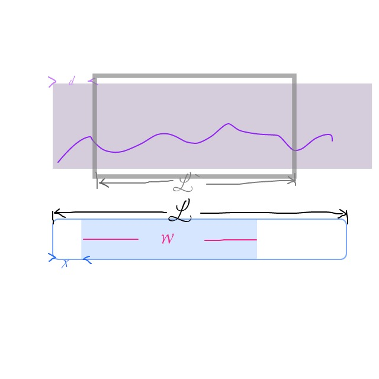

# Simple Timeline
This repository will show you how to make a simple timeline with SVG 😃

See the demo 👉🏻[here](https://nagisa1993.github.io/SimpleTimeline.io/)

## How?
1️⃣ Create an SVG element;

2️⃣ Define a clippath inside this SVG;

3️⃣ Draw data-display path for your data display;

4️⃣ Draw grid (x & y);

5️⃣ Draw controllers (two small scrollbars and a mask) inside a group;

6️⃣ Write JavaScript to make controllers move! 
```
scrollbars 👉🏻 "single move" 👉🏻 only change relative translate transform.
mask 👉🏻 "group move" 👉🏻 change absolute translate transform. 
While moving, calculate translate and scale value for data-display area to make it move accordingly!
```

## Some Little Math

```
rate = w / L
dataVisible length = rate * dataLength
dataInvisible length = - x * dataLength / L

assume the dataLength after scaling is L1, we get:
w / L = L` / L1
so scale = L1 / dataLength =  L` / (rate * dataLength)
so d = dataInvisible length * scale
```
